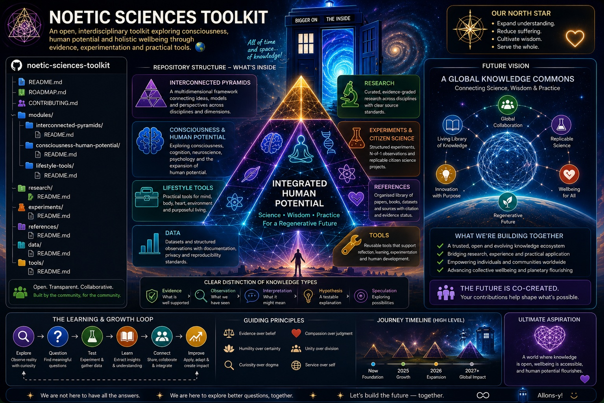

# 🧠 The Noetic Sciences Toolkit

> An open-source toolkit for consciousness research and human potential, integrating science, contemplative practice, measurement, replication and interdisciplinary wisdom to support human flourishing.

## 🌍 Vision

The **Noetic Sciences Toolkit** is an open, evolving knowledge commons exploring consciousness, human potential, wellbeing and transformative practices.

It brings together scientific research, contemplative knowledge, practical tools, citizen science, experimentation and interdisciplinary perspectives.

The long-term vision is to grow from a GitHub repository into a collaborative **global knowledge commons** where ideas can be connected, tested, challenged, replicated and improved.

## 🔺 Interconnected Pyramids

### Many Pyramids, One Blueprint

Different models of human development, wellbeing, cognition and consciousness can be explored as complementary and interchangeable perspectives.

> **Many pyramids. Many perspectives. One interconnected system.**

## 🧠 Consciousness & Human Potential

Explore questions surrounding:

- Consciousness
- Cognition
- Human development
- Creativity
- Wellbeing
- Contemplative practice
- Meaning and purpose
- Human potential

## 🧰 Lifestyle Tools

Develop practical tools for:

- 🧠 Mind
- 🏃 Body
- ❤️ Heart
- 🧘 Consciousness
- 🌍 Environment
- ✨ Purpose

The aim is to support **agency, reflection and informed choice**, rather than prescribe a single way of living.

## 🔬 Research

A growing collection of interdisciplinary research covering areas such as:

- Neuroscience
- Psychology
- Consciousness studies
- Contemplative science
- Human development
- Systems science
- Psychedelic research
- Human–environment relationships

## 🧪 Experiments & Citizen Science

Develop structured experiments, N-of-1 observations and citizen-science projects.

The basic research cycle is:

**Question → Hypothesis → Method → Observation → Analysis → Replication → Learning**

## 📚 References

A transparent bibliography connecting Toolkit claims and frameworks to research papers, books, datasets and other relevant sources.

## 📊 Data

A dedicated space for structured observations and research data, with an emphasis on documentation, privacy, transparency and reproducibility.

## ⚖️ Evidence Framework

The Toolkit distinguishes between:

**Evidence → Observation → Interpretation → Hypothesis → Speculation**

Interesting ideas are welcome.

So is scepticism.

> **Interesting is not the same as proven.**

The project aims to remain open to evidence that challenges its own assumptions.

## 🔄 Guiding Loop

**Explore → Question → Test → Learn → Connect → Improve**

This is intentionally a **work in progress**.

The goal isn't to create another belief system or impose a predetermined worldview.

It is to create useful frameworks and tools for asking better questions about consciousness and human potential.

## 🤝 Community

The Toolkit welcomes:

- Research
- Critical review
- Alternative models
- Replication
- Experiments
- Visualisations
- Practical tools
- Documentation
- Corrections
- New questions

The project is **pro-inquiry, not pro-belief**.

## 🗺️ Repository

- [`modules/`](modules/) — Frameworks and Toolkit modules
- [`research/`](research/) — Research materials
- [`research/research-database-framework.md`](research/research-database-framework.md) — Structured research database framework
- [`research/evidence-rating-methodology.md`](research/evidence-rating-methodology.md) — Evidence-rating methodology
- [`research/open-research-questions.md`](research/open-research-questions.md) — Open research questions and gaps
- [`experiments/`](experiments/) — Experiments and citizen science
- [`references/`](references/) — Sources and bibliography
- [`references/REFERENCE_FORMAT.md`](references/REFERENCE_FORMAT.md) — Structured reference format
- [`data/`](data/) — Structured data and observations
- [`tools/`](tools/) — Practical reusable tools
  - [🔺 Interconnected Pyramids Reflection Tool](tools/interconnected-pyramids-reflection.md)
- [`ROADMAP.md`](ROADMAP.md) — Development roadmap
- [`CONTRIBUTING.md`](CONTRIBUTING.md) — Contribution guidelines

## 🚀 Future Vision

From a small open repository today toward a living, collaborative knowledge commons tomorrow.

A place where:

**Science + Wisdom + Practice + Experimentation + Community**

can meet without requiring certainty before exploration.

🌱 **Many perspectives. One interconnected toolkit.**

> **The future is co-created.**
