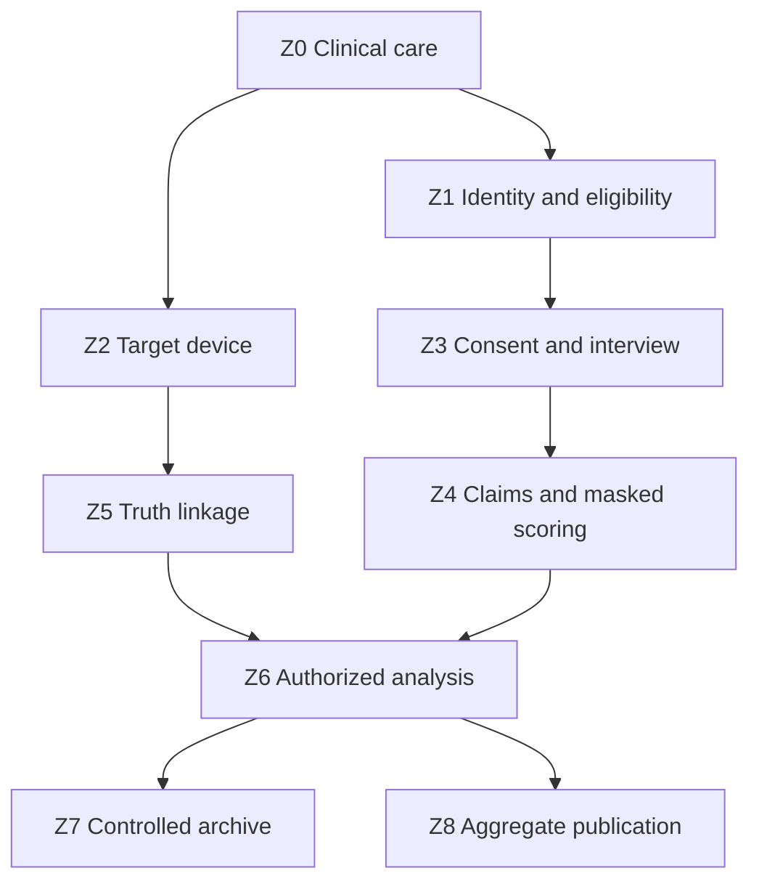
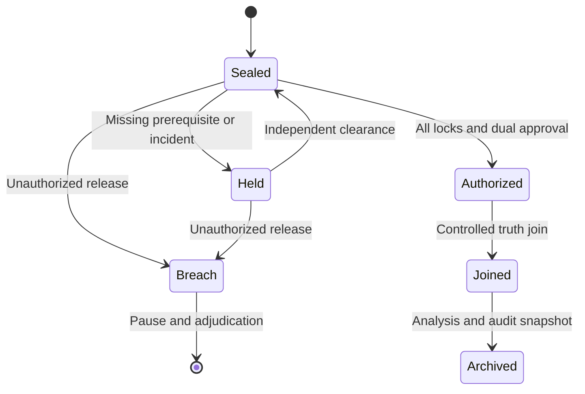

# COA-001 Data-Flow, Access and Leakage Threat Model

**Module:** DFL-001  
**Version:** 0.1  
**Date:** 2026-09-17  
**Draft amendment:** 2026-09-24 · INT-001 v0.2 alignment; no operational authorisation  
**State:** DRAFT / STAGE-0 / NOT IMPLEMENTED OR VALIDATED  
**Parent protocol:** COA-001 v0.1  
**Related modules:** TS-001 v0.1 · INT-001 v0.2 · SDC-001 v0.1 · EDP-001 v0.1 · SAP-001 v0.1  
**Governance:** Issue #356 · Draft PR #357

## Purpose and boundary

DFL-001 maps every intended COA-001 data object, trust boundary, permitted access and release step from event identification through aggregate reporting. It also defines adversarial and accidental routes by which target truth, participant identity, interview content or clinical information could leak, be altered or become falsely linked.

This is a design and review artifact. It is not an implemented architecture, penetration test, privacy certification or authorization for live participant-data processing.

Controls are designed to reduce, detect, measure and test leakage. They do not “exclude” or prove the absence of ordinary access. Unresolved routes remain explicit and block progression.

The control structure is informed by [NIST SP 800-53 Rev. 5](https://csrc.nist.gov/pubs/sp/800/53/r5/upd1/final), the [NIST Cybersecurity Framework 2.0](https://www.nist.gov/cyberframework), [NIST SP 800-61 Rev. 3](https://csrc.nist.gov/pubs/sp/800/61/r3/final) and the [OWASP threat-modeling lifecycle](https://owasp.org/www-community/Threat_Modeling). Site-specific hospital, privacy, device and research requirements prevail.

## Security and scientific objectives

The architecture must protect:

1. **Clinical safety:** research cannot affect resuscitation.
2. **Participant confidentiality:** identity, health information and narratives remain protected.
3. **Target confidentiality:** no participant-facing or scoring role learns truth before the authorized boundary.
4. **Source integrity:** recordings, transcripts, targets, logs, scores and consent states are attributable and tamper-evident.
5. **Temporal integrity:** event, display, interview, lock and release ordering is auditable with uncertainty.
6. **Linkage integrity:** the correct event, participant, target session, transcript and score are joined.
7. **Decoy exchangeability:** candidate construction cannot use transcript content or reveal truth through metadata.
8. **Availability:** failures remain recoverable or explicitly classified; they never vanish from denominators.
9. **Analytic validity:** unauthorized access, contamination and integrity events have prespecified consequences.
10. **Governance containment:** AkashicNET and public systems receive no participant-level data.

A security control passing does not establish awareness or continuity. A target match observed after compromised blinding is not rescued by narrative strength.

## Threat-model method

Each site must maintain a versioned threat register containing:

- asset and data-object ID;
- trust boundary;
- threat actor or failure source;
- precondition and attack/failure path;
- confidentiality, integrity, availability, privacy, safety and scientific-validity impact;
- preventive, detective and recovery controls;
- accountable owner;
- commissioning and recurring test;
- evidence produced;
- residual risk;
- protocol consequence;
- status and review date.

Threats include malicious action, curiosity, ordinary human error, misconfiguration, equipment failure, supply-chain compromise, inference from metadata, collusion and emergency-workflow pressure.

Risk acceptance requires institutional security, privacy, clinical and scientific owners. The study team cannot accept a critical residual risk alone.

## Trust zones

| Zone | Name | Contents | Default trust rule |
|---|---|---|---|
| Z0 | Clinical-care environment | Patient, staff, EHR, monitors, room, resuscitation workflow | Care priority; study has no control over care |
| Z1 | Eligibility and identity enclave | Event screening, consent, identity-to-study-ID linkage | Institutional only; no target truth |
| Z2 | Target-device enclave | Frozen assets, RNG, display control, render and sensor logs | No participant identity or interview content |
| Z3 | Interview enclave | Recording, transcript, contamination and consent states | No target truth or room-event logs before lock |
| Z4 | Claim/scoring enclave | Redacted transcript, claim table, masked candidate sets, scores | No identity or truth position |
| Z5 | Truth-linkage enclave | Encrypted event-target-candidate linkage and seed secrets | Dual-control custodians only |
| Z6 | Analysis enclave | Locked pseudonymous scores, truth join after authorization | No direct identity; access logged |
| Z7 | Controlled archive | Immutable records, approvals, code, audit evidence | Read-only, retention-controlled |
| Z8 | Public/AkashicNET boundary | Aggregate protocol and disclosure-reviewed results | No participant-level or operational-secret data |

No direct route from Z2 or Z5 to participant-facing staff is permitted. No route from Z1, Z3, Z4, Z5 or Z6 to Z8 is permitted except the reviewed aggregate-publication flow.

## End-to-end topology

Arrows indicate permitted classes of flow, not unrestricted network connectivity. Every actual transfer requires the matrix controls below.

## Data-object register

| ID | Object | Identifiability/sensitivity | Authoritative owner | Forbidden destination before release |
|---|---|---|---|---|
| D01 | Eligible-event ledger | Identifiable/high | Z1 controller | Z2, Z4, Z8 |
| D02 | Identity linkage table | Direct identifier/critical | Z1 linkage custodian | Z2–Z4, Z8 |
| D03 | Consent and capacity record | Identifiable/high | Z1 consent team | Z2, Z4, Z8 |
| D04 | Minimum clinical timing extract | Pseudonymous/high | Z1 clinical-data custodian | Z2 before permitted sync; Z8 |
| D05 | Frozen target asset manifest | Operational secret/high | Z2 target custodian | Z0, Z1, Z3, Z8 |
| D06 | RNG seed commitment | Operational secret/critical | Z5 independent custodian | Z0–Z4 |
| D07 | Activation command/event | Pseudonymous/medium | Z2 device | Z3 until authorized |
| D08 | Intended-render log | Pseudonymous/high integrity | Z2 device | Z3 until lock |
| D09 | Independent-display evidence | Pseudonymous/high integrity | Z2 sensor custodian | Z3 until lock |
| D10 | Encrypted target evidence package | Critical | Z5 truth custodian | Z0–Z4 |
| D11 | Interview source recording | Identifiable/re-identifiable/critical | Z3 transcript custodian | Z2, Z4 unredacted, Z8 |
| D12 | Final locked transcript | Pseudonymous/high | Z3 transcript custodian | Z2, Z5 content, Z8 |
| D13 | Contamination/blinding audit | Pseudonymous/high | Z3 audit custodian | Z2, Z8 |
| D14 | Atomic claim table | Pseudonymous/high | Z4 claim custodian | Z2, Z5 |
| D15 | Decoy-pool manifest | Operational secret/high | Z2/Z5 decoy custodian | Z3, Z8 |
| D16 | Masked candidate set | Pseudonymous/high | Z4 packet assembler | Z3; no truth metadata |
| D17 | Independent scorer records | Pseudonymous/high | Z4 scoring custodian | Z2, Z3, Z5 before lock |
| D18 | Truth-position linkage | Critical | Z5 unblinding custodians | Z0–Z4 |
| D19 | Locked analysis dataset | Pseudonymous/high | Z6 statistician | Z0–Z5 except controlled queries; Z8 |
| D20 | Aggregate result package | Disclosure-reviewed | institutional sponsor | Only D20 may reach Z8 |
| D21 | Access and security logs | Pseudonymous/high | security owner | Uncontrolled users and Z8 |
| D22 | Incident and adjudication record | Pseudonymous/high | independent integrity body | Z8 case-level detail |
| D23 | Software/build/dependency manifest | Operational/medium | system owner | Public only after secret review |
| D24 | Key material and recovery shares | Critical | separate key custodians | All ordinary application roles |

A pseudonymous ID is not an authorization token. Knowing an ID does not grant access to another zone.

## Permitted flow matrix

| Flow | From → To | Object/purpose | Preconditions | Required controls | Audit evidence | Fail-closed state |
|---|---|---|---|---|---|---|
| F01 | Z0 → Z1 | D01 eligibility identification | Approved source and authority | Minimum fields, authenticated service account, reconciliation | Source count, import digest, operator/time | `ELIGIBILITY_FEED_INCOMPLETE` |
| F02 | Z1 internal | D02 create study ID | Eligible event exists | CSPRNG ID, uniqueness check, separate encrypted linkage | Mapping receipt, collision test | `CASE_LINKAGE_UNCERTAIN` |
| F03 | Z1 → Z2 | Pseudonymous activation token only | Commissioned device expected operational | No identity/clinical narrative; signed bounded message | Send/receive timestamp and digest | `ACTIVATION_TOKEN_INVALID` |
| F04 | Z2 internal | D05–D10 target generation/display | Valid activation | Post-activation RNG, frozen manifest, measured build, hash chain | RNG proof, render log, signatures | TS-001 failure taxonomy |
| F05 | Z2 sensor → Z2 evidence store | D09 actual-display evidence | Privacy-preserving sensor commissioned | Independent channel, no image/audio capture by default | Sensor calibration and signed sample | `DISPLAY_NOT_INDEPENDENTLY_VERIFIED` |
| F06 | Z0/Z1 → Z3 | D03/D04 approved approach context | Treating-team clearance and consent pathway | Minimum necessary disclosure; no target/device status | Access log and interviewer declaration | `INTERVIEWER_BLIND_UNCERTAIN` |
| F07 | Z3 internal | D11–D13 interview and lock | INT-001 readiness/consent | Institution recorder, encryption, transcript digest, append-only amendment | Source/transcript/metadata digests | `TRANSCRIPT_LOCK_INCOMPLETE` |
| F08 | Z3 → Z4 | Redacted D12/D13 | Final lock verified | Automated plus human redaction, no identity or target hints | Redaction report and transfer digest | `SCORING_PACKET_REDACTION_FAIL` |
| F09 | Z4 internal | D14 claim extraction | No candidate access | Two blind coders, lock before candidates | Claim-table digest, role/access proof | `CLAIM_SET_NOT_BLIND` |
| F10 | Z2/Z5 → Z4 | D15/D16 masked candidates | Claim lock and precommitted decoy rule | Deterministic generation, metadata stripping, randomized labels | Candidate manifest/digest | `CANDIDATE_METADATA_LEAK` |
| F11 | Z4 internal | D17 scoring | Candidate set committed | Independent accounts, no truth link, score lock | Score digests and access logs | `SCORE_LOCK_INCOMPLETE` |
| F12 | Z1/Z3/Z4/Z5 → Z6 | D03/D04/D13/D17/D18 controlled join | All locks and authorization complete | Dual control, isolated analysis job, query-limited joins | Release approvals, snapshot digest | `UNBLINDING_NOT_AUTHORIZED` |
| F13 | Z6 internal | D19 primary analysis | SAP/code/data lock | Reproducible environment, no network export, output disclosure scan | Code/build/output digests | `ANALYSIS_ENVIRONMENT_INTEGRITY_FAIL` |
| F14 | Z6 → Z7 | Locked dataset/results/audit | Analysis release approved | Encrypted immutable archive, retention rule | Archive receipt and restore test | `ARCHIVE_COMMIT_FAILED` |
| F15 | Z6/Z7 → Z8 | D20 aggregate package only | Ethics/sponsor/disclosure review | Small-cell and narrative review; no secrets/raw data | Signed publication approval | `PUBLICATION_GATE_CLOSED` |
| F16 | Any zone → incident function | D21/D22 incident signal | Suspected event | Preserve evidence, contain, notify, adjudicate | Incident timeline and CAPA | `PAUSED_PENDING_ADJUDICATION` |
| F17 | Archive → destruction | Expired data | Retention trigger and legal hold check | Dual approval, processor propagation, backup expiry | Destruction certificate | `DELETION_NOT_VERIFIED` |

No additional flow is allowed by implication. A site-specific addition requires updated threat analysis, ethics/privacy review, tests and version control.

### Interview revision boundaries

INT-001 v0.2 introduces the following proposed restrictions:

- F07 produces L1 primary source objects. Any approved L2 supplement is a separate object; it cannot overwrite D11/D12 or add primary claims.
- F08 carries only the primary redacted L1 source and permitted contamination metadata. It excludes later structured/recognition content from primary coding.
- F09 produces C1 under transcript-only access. Claim coders cannot subsequently act as primary scorers for the same participant-event.
- F10 occurs only after L1/C1 verification, valid data-use authority, incident clearance, approved restricted candidate preparation and committed masked manifests. Generators have no transcript content.
- F11 continues to require independent masked scoring and score locks.
- F12 is the later truth join. Earlier candidate preparation is not F12 and cannot waive any F12 prerequisite.

D16 remains forbidden in Z3. No participant recognition zone or transfer is added. Z4 claim and scoring roles require distinct permissions even though they share a zone label. Role names without enforced access separation are not a control.

All flows remain design specifications. An unresolved implementation, consent, integrity or timing condition means HOLD. All research, publication and promotion restrictions remain in force.

## Role-access matrix

Access states are `R` read, `W` create/update, `C` custodial ciphertext/key operation without content use, and `—` no access.

| Role | D01–D04 identity/clinical | D05–D10 targets | D11–D13 interview | D14–D17 scoring | D18 truth link | D19 analysis | D20 public |
|---|---:|---:|---:|---:|---:|---:|---:|
| Treating team | R clinical only | — | Clinical need only | — | — | — | — |
| Eligibility/consent team | RW minimum | — | Consent fields only | — | — | — | — |
| Linkage custodian | C/R linkage | — | ID mapping only | — | — | — | — |
| Device operator | Pseudonymous token only | RW operational | — | — | — | — | — |
| Target custodian | — | C/R | — | Masked generation only | C | — | — |
| Interviewer | Minimum approach context | — | RW assigned | — | — | — | — |
| Transcript processor | Pseudonymous metadata | — | RW assigned | — | — | — | — |
| Claim coder | — | — | Redacted R | RW D14 | — | — | — |
| Scorer/adjudicator | — | Masked candidates only | Redacted R | RW assigned | — | — | — |
| Unblinding custodian | — | Ciphertext/manifest | Digests only | Digests only | C/R dual control | Release only | — |
| Statistician | Pseudonymous minimum | No plaintext before release | Derived flags | Locked scores | Joined after authorization | RW | Draft aggregate |
| Security auditor | Metadata/minimum | Logs/builds | Logs/digests | Logs/digests | Access logs, not content | Logs/builds | — |
| Ethics/privacy monitor | Authorized minimum | Safety metadata | Authorized audit | Status metadata | Release evidence | Aggregate/controlled | Approval |
| AkashicNET/public team | — | — | — | — | — | — | R D20 only |

Access must be enforced technically, not only promised in role descriptions. Emergency administrator access is time-limited, separately authenticated, alerted in real time and independently reviewed.

## Key, secret and credential custody

- Identity-linkage keys, target-package keys, truth-position keys and archive keys are distinct.
- No application service or person holds every key required to connect identity, transcript and truth.
- Dual control applies to truth release and recovery shares.
- Recovery material is encrypted, geographically and administratively separated, inventoried and tested using synthetic data.
- Key creation, use, rotation, suspension, recovery and destruction generate signed audit events.
- Shared accounts and shared MFA devices are prohibited.
- Privileged access is just-in-time where technically possible.
- Service credentials are scoped to one flow, rotated and excluded from source code, logs and backups.
- Loss of key custody is a critical integrity incident, not a reason to improvise access.

Dual control reduces single-person risk but does not eliminate collusion; independent monitoring and post-release reconciliation remain required.

## Display truth versus intended rendering

Four states must remain distinct:

1. **Asset selected:** the RNG selected a frozen asset/sequence.
2. **Render instructed:** software issued the intended render command.
3. **Render acknowledged:** the graphics/device stack reported success.
4. **Display independently evidenced:** a commissioned independent sensor supports that intended pixels/sound were physically presented during the logged interval.

Software acknowledgement alone cannot establish state 4.

Independent verification should use privacy-preserving technical sensing, such as a bounded photometric or electrical channel that cannot reconstruct the room, patient, staff, screens or speech. Any camera or microphone requires the separate EDP-001 audiovisual pathway.

The verifier must be independently calibrated, time-synchronized, signed and tested for replay, substitution, obstruction and false-positive signals.

## Adversaries and failure sources

The model includes:

- curious or convinced clinical/research staff;
- participant, family or visitor prior knowledge;
- malicious insider;
- colluding insiders across nominally separate roles;
- compromised administrator or vendor;
- external network attacker;
- supply-chain or update compromise;
- stolen or misused credential;
- lost/stolen endpoint or removable media;
- accidental misrouting, copy/paste or screen sharing;
- metadata, filename, thumbnail, cache or ordering inference;
- physical observation, reflection, camera or acoustic leakage;
- clock drift, replay or case mislinkage;
- device, sensor, storage or backup failure;
- scorer expectancy and post-hoc decoy selection;
- premature unblinding;
- public re-identification from a distinctive narrative;
- unapproved cloud, transcription or AI processing;
- emergency-workflow shortcuts and staffing pressure.

No threat is dismissed solely because staff are trusted.

## Adversarial leakage register

| ID | Leakage route | Impact | Required prevention/detection | Commissioning/adversarial test | Protocol consequence |
|---|---|---|---|---|---|
| L01 | Direct line of sight from bed/floor | Critical validity | Concealed placement, measured viewing geometry | Multi-height/angle survey with room configurations | Configuration blocked |
| L02 | Mirrors, glass, polished equipment or transient reflections | Critical validity | Reflection inventory, placement controls, periodic room check | Lights-on/off adversarial reflection sweep | `CONCEALMENT_BREACH` |
| L03 | CCTV, body camera, phone or visitor capture | Critical privacy/validity | Policy, signage where lawful, physical controls, no personal devices | Camera inventory and unauthorized-device drill | Hold affected site/case |
| L04 | Audible device cues, fan, relay, tones or staff observation | High validity | Silent design, acoustic masking only if clinically safe, uniform operation | Blind activation-detection test | Redesign; no activation |
| L05 | Network traffic or status dashboard reveals activation/target | Critical | Network isolation, constant-size/timing traffic where needed, least privilege | Packet/telemetry observation test | `TARGET_METADATA_LEAK` |
| L06 | Filename, EXIF, thumbnail, ordering, resolution or compression cue | Critical | Canonical rendering and metadata stripping | Automated metadata diff and blind distinguishability test | Candidate set invalid |
| L07 | Admin, maintenance or vendor plaintext access | Critical | No routine plaintext, JIT access, supervised maintenance, logged break-glass | Privileged-path review and vendor exercise | Pause/adjudicate |
| L08 | Software update changes RNG/render/logging | Critical | Signed pinned builds, SBOM, reproducible/measured build, change window | Build reproduction and rollback test | Device uncommissioned |
| L09 | Physical port, removable media or debug interface | Critical | Disable/seal ports, boot control, inventory | Tamper and unauthorized-boot test | `DEVICE_INTEGRITY_FAIL` |
| L10 | Clock spoof, drift or replay | Critical timing | Authenticated time, monotonic counter, drift bounds, signed sync | Offset, reboot and replay tests | Timing unknown/unrecoverable |
| L11 | Log deletion, truncation, reorder or fork | Critical integrity | Hash chain, signatures, remote receipt, closing digest | Deletion/reorder/fork injection | `LOG_CHAIN_INVALID` |
| L12 | Sensor replay or render false positive | Critical validity | Challenge-linked evidence, independent clock, anti-replay counter | Simulated no-display/replay/obstruction | Exposure not valid |
| L13 | Event-target-transcript mislinkage | Critical | Pseudonymous signed tokens, four-eyes join, reconciliation | Cross-case swap and duplicate-ID tests | `CASE_LINKAGE_UNCERTAIN` |
| L14 | Staff/family tells participant room or target details | Critical contamination | Separation, scripts, contamination audit, no feedback | Scenario rehearsal and delayed interview audit | Flag and sensitivity/bounds |
| L15 | Interviewer learns activation or clinical event details | Critical bias | Minimum approach context, separate staff, declaration | Seeded information-exposure drill | `INTERVIEWER_CRITICAL_UNBLINDING` |
| L16 | Transcript reaches target custodian or device team | Critical | Zone separation, deny-by-default ACL, DLP alerts | Attempted cross-zone access | Pause/adjudicate |
| L17 | Decoys chosen after reading transcript | Critical inferential | Deterministic precommitted algorithm; prohibited inputs | Reproduce from frozen inputs only | Packet invalid |
| L18 | Scorer learns truth through label or interface | Critical | Per-packet random mask, identical UI, no truth metadata | Blind distinguishability and canary tests | `PREMATURE_TRUTH_REVEAL` |
| L19 | Score revised after truth or peer score exposure | Critical | Independent lock, immutable versions, no correctness feedback | Workflow-order and audit-log test | Primary score compromised |
| L20 | Unblinding before all locks | Critical | Machine-enforced prerequisites, dual approval | Negative test each missing prerequisite | `PREMATURE_UNBLIND` |
| L21 | Linkage key or recovery share compromise | Critical privacy/validity | Split custody, rotation, HSM/approved vault, alerts | Recovery and stolen-share exercise | Site/case hold |
| L22 | Backup, crash dump, cache or search index copies plaintext | Critical privacy | Encrypted scoped backups, dump/cache controls, inventory | Restore/search/cache inspection | Breach assessment |
| L23 | Unapproved transcription, cloud or AI service | Critical privacy | Approved processors only, egress controls, staff training | DLP and simulated upload test | Breach/processor incident |
| L24 | Public narrative re-identifies participant/staff/family | Critical privacy | Aggregate output, disclosure review, separate quote pathway | Motivated-intruder review | Publication blocked |
| L25 | Analyst infers identity from rare clinical combination | High privacy | Field minimization, coarsening, controlled enclave | Re-identification risk review | Dataset reduced/held |
| L26 | Insider collusion bridges separated roles | Critical | Independent institutions/monitoring, anomaly detection, rotation | Collusion tabletop and access-correlation review | Residual risk decision |
| L27 | Unauthorized result access changes behaviour during accrual | Critical bias | Masked dashboards, no score outputs, release embargo | Attempted interim-query test | Accrual/analysis pause |
| L28 | Incident silently repaired without trace | Critical assurance | Immutable incident IDs, CAPA, external oversight | Tabletop with tempting “quick fix” | Governance failure |
| L29 | Denominator failure hides device or security failures | Critical bias | Independent eligibility source and reconciliation | Inject missing/failed records | Gate failure |
| L30 | Research distracts or alters resuscitation | Critical safety | Passive device, clinical stop authority, no bedside tasks | Human-factors simulation | Immediate safety shutdown |

Each site must add local architecture and workflow threats. A generic “mitigated” label without test evidence is not acceptable.

## Metadata and side-channel controls

Before scoring or release, compare true and decoy candidates for:

- file type and size;
- dimensions, duration and frame/sample rate;
- encoding and compression profile;
- creation/modification times;
- EXIF, XMP, ID3 and embedded application metadata;
- filename length/pattern;
- directory order and archive position;
- thumbnail/cache presence;
- color profile and rendering path;
- loading time and network request pattern;
- UI focus, hover, accessibility and keyboard order;
- error, retry and logging behaviour.

A blinded technical team should attempt to identify truth position using only metadata and interface behaviour. Performance above the frozen chance tolerance blocks operational use.

## Software, supply-chain and change controls

Before commissioning:

- source and build provenance recorded;
- dependencies and firmware inventoried;
- SBOM or equivalent manifest produced;
- signatures and digests verified;
- reproducible build attempted or measured-build evidence recorded;
- secure boot and update verification configured;
- network/services minimized;
- vulnerability review and patch policy approved;
- development, test and production separated;
- synthetic data only in development;
- rollback and recovery tested.

After commissioning, any change to hardware, firmware, operating system, application, target library, configuration, sensor, network, time source or physical room layout triggers impact assessment and defined re-commissioning. Emergency patches create a new measured configuration; “same software” cannot be assumed.

## Logging and continuous review

The canonical audit event includes:

- event ID and previous-event digest;
- authenticated UTC time plus monotonic counter;
- zone, system and pseudonymous actor/service ID;
- object and action;
- purpose/authorization reference;
- success/failure;
- source and destination;
- data classification;
- protocol/software/configuration version;
- incident link where applicable;
- signature or message-authentication evidence.

Logs must avoid transcript, target plaintext, direct identity and secret material. Clock uncertainty is recorded, not silently normalized.

Daily or event-driven alerts cover:

- failed or out-of-hours privileged access;
- cross-zone access attempts;
- bulk reads/exports;
- key or recovery-share use;
- disabled logging;
- time-source changes;
- unexpected software/build drift;
- target/plaintext queries;
- unblinding requests;
- publication-zone transfers.

An independent reviewer signs periodic access-log reconciliation. An unread log is not an effective control.

## Unblinding state machine

Required machine checks before `Authorized`:

- consent/data-use state permits the operation;
- transcript and claim-set locks verify;
- candidate and score locks verify;
- contamination and integrity states are complete;
- decoy manifest and generation reproduce;
- analysis code and environment are locked;
- no unresolved critical incident exists;
- independent access-log review is complete;
- two named custodians approve the exact release;
- release scope, purpose and expiry are recorded.

No email, chat message, spreadsheet or verbal instruction substitutes for the state-machine release.

## Incident severity and analytic consequences

| Severity | Example | Immediate action | Analytic consequence |
|---|---|---|---|
| Critical | Truth leak, patient-safety interference, identity/health breach, forged display evidence | Stop affected operation, contain, notify independent authority | Hold case/site; primary interpretation blocked pending adjudication |
| High | Unresolved admin access, metadata cue, linkage uncertainty, clock outside tolerance | Isolate and investigate | Unknown/unrecoverable or bounded sensitivity state |
| Moderate | Non-sensitive availability failure with intact audit trail | Repair under change control | Retain failure; gate consequence |
| Low | Documented cosmetic issue with no plausible data/safety effect | Track and correct | No silent dismissal; justify no analytic effect |

Security severity and personal-data breach notification are separate assessments; either may require escalation.

Incident response follows preparation, detection, containment, recovery and learning principles. Evidence is preserved before repair. Every incident has an owner, timeline, notification decision, root cause, corrective/preventive action and closure approval.

## Commissioning and adversarial validation plan

Operational use requires independent evidence for:

1. physical concealment and reflection routes;
2. auditory and electromagnetic cues;
3. camera/visitor/personal-device routes;
4. actual-display verification and anti-replay;
5. network and dashboard metadata;
6. privileged/admin/vendor paths;
7. port, boot and removable-media controls;
8. build, dependency and update integrity;
9. clock drift, spoof and reboot;
10. log deletion, fork and signature failure;
11. cross-case mislinkage;
12. transcript redaction and cross-zone denial;
13. deterministic decoy reproduction;
14. candidate metadata/interface distinguishability;
15. scoring lock and truth-release ordering;
16. backup, cache, crash dump and restore;
17. key loss, compromise and recovery;
18. DLP against unapproved cloud/AI export;
19. public-output re-identification;
20. incident tabletop, notification and CAPA;
21. clinical human-factors and safety shutdown;
22. denominator reconciliation with injected failures.

Tests use synthetic data. Findings, severity, remediation and retest evidence are preserved. The team that built a control cannot be its sole validator.

## Stage-1 security and leakage gates

Stage 1 must report, pooled and by site:

- commissioned configurations and unresolved viewing routes;
- valid independent-display evidence rate;
- build/manifest match rate;
- device/log/package recoverability;
- clock accuracy and uncertainty;
- unauthorized plaintext access;
- premature unblinding;
- interviewer/scorer blinding breaches;
- candidate metadata distinguishability;
- cross-zone access attempts;
- linkage uncertainty;
- security/privacy incidents;
- time to detection, containment and adjudication;
- denominator reconciliation;
- test coverage and unresolved residual risks.

Unknown or unrecoverable states count against applicable gates. Zero events are reported with uncertainty and do not prove zero risk.

A mandatory security, privacy or safety gate cannot be offset by an interesting target match.

## Required before live activation

- site-specific topology and data inventory;
- completed flow and role matrices;
- institutional security architecture approval;
- privacy/DPIA approval;
- production implementation evidence;
- independent penetration/adversarial assessment;
- independent physical and clinical human-factors testing;
- decoy-exchangeability and metadata-blindness testing;
- key, credential and recovery rehearsal;
- incident and breach exercise;
- access-log review procedure;
- signed commissioning baseline;
- change/re-commissioning policy;
- external domain sign-off;
- ethics/IRB and regulatory authorization.

Until these exist, `SECURITY_SPECIFIED_NOT_IMPLEMENTED` and `RECRUITMENT_NOT_AUTHORIZED` remain true.

## Machine-readable states

- `SECURITY_SPECIFIED_NOT_IMPLEMENTED`
- `SITE_TOPOLOGY_INCOMPLETE`
- `DATA_FLOW_NOT_AUTHORIZED`
- `ROLE_ACCESS_NOT_ENFORCED`
- `ELIGIBILITY_FEED_INCOMPLETE`
- `ACTIVATION_TOKEN_INVALID`
- `DISPLAY_NOT_INDEPENDENTLY_VERIFIED`
- `TARGET_METADATA_LEAK`
- `TRANSCRIPT_LOCK_INCOMPLETE`
- `SCORING_PACKET_REDACTION_FAIL`
- `CLAIM_SET_NOT_BLIND`
- `CANDIDATE_METADATA_LEAK`
- `SCORE_LOCK_INCOMPLETE`
- `UNBLINDING_NOT_AUTHORIZED`
- `ANALYSIS_ENVIRONMENT_INTEGRITY_FAIL`
- `ARCHIVE_COMMIT_FAILED`
- `PUBLICATION_GATE_CLOSED`
- `DELETION_NOT_VERIFIED`
- `KEY_CUSTODY_BREACH`
- `CROSS_ZONE_ACCESS_ATTEMPT`
- `PAUSED_PENDING_ADJUDICATION`
- `SITE_SECURITY_COMMISSIONED`
- `RECRUITMENT_NOT_AUTHORIZED`

TS-001 states remain authoritative for device failures, including `VALID_TARGET_EXPOSURE`, `NO_ACTIVATION`, `LATE_ACTIVATION`, `PARTIAL_DISPLAY`, `POWER_INTERRUPTION`, `CLOCK_OUT_OF_TOLERANCE`, `LOG_CHAIN_INVALID`, `SIGNATURE_INVALID`, `ASSET_MANIFEST_MISMATCH`, `DEVICE_INTEGRITY_FAIL`, `CONCEALMENT_BREACH`, `PREMATURE_UNBLIND`, `CASE_LINKAGE_UNCERTAIN`, `PACKAGE_UNRECOVERABLE`, `DEVICE_STATUS_UNKNOWN`, `TARGET_EXPOSURE_UNKNOWN` and `SAFETY_SHUTDOWN`.

## Governance lock

- BQ001 status: **UNRESOLVED**
- BQ001 depth: **Level 6/10**
- Accepted canonical edges: **0**
- `supports_models`: **[]**
- Truth inference: **OFF**
- Scientific-evidence promotion: **OFF**
- Rights/public synthesis: **OFF**
- Website promotion: **OFF**
- Recruitment: **NOT AUTHORIZED**
- Live participant-data processing: **NOT AUTHORIZED**
- Security state: **SPECIFIED, NOT IMPLEMENTED OR VALIDATED**
- COA-001 state: **DRAFT / PROTOCOL-FEASIBLE NOT YET ESTABLISHED**

DFL-001 cannot change BQ001, prove the absence of leakage or authorize live research.

