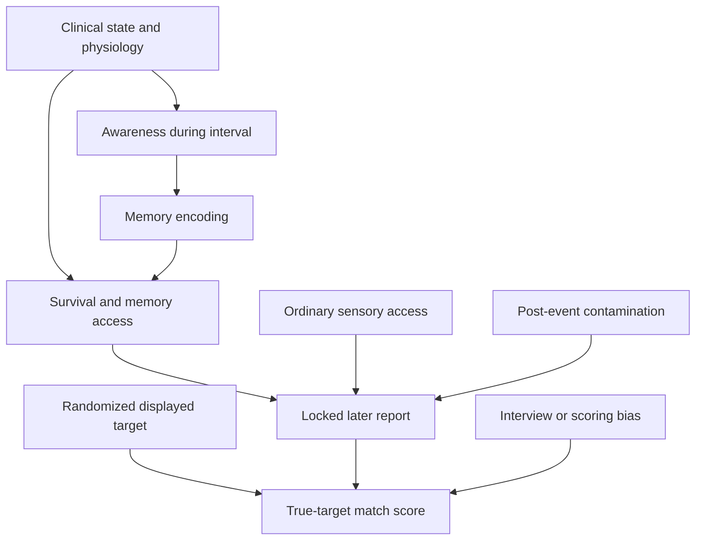

# COA-001 — Continuity of Awareness During Resuscitation

**Protocol synopsis:** v0.1  
**Date:** 2026-09-17  
**State:** DRAFT / STAGE-0 METHOD DEVELOPMENT  
**Parent inquiry:** BQ001  
**Governance issue:** [#356](https://github.com/tws9stmcbf-web/AkashicNET/issues/356)

## Plain-language purpose

COA-001 asks whether a person who survives an in-hospital cardiac arrest can later report specific, independently timed information from the resuscitation interval under conditions designed to reduce, measure and test ordinary visual access, information leakage and flexible after-the-fact scoring.

The directly observed outcome is a later locked report and its correspondence with independently timed information. Awareness during the interval is a latent construct inferred only indirectly through that proxy. A correspondence, even if statistically unusual, does not by itself establish awareness, continuity, personal survival or an afterlife.

The first study does **not** test whether consciousness survives death. It tests whether the research procedure is reliable enough to justify a larger confirmatory study.

## Construct boundary

| Term | COA-001 use |
|---|---|
| Consciousness | Umbrella concept; not treated as a single directly measured variable |
| Awareness | Latent construct of interest; not directly observed. Its operational proxy is a later locked report with time- or event-linked episodic content |
| Sentience | Out of scope for v0.1; the capacity for subjective or valenced experience is too broad for the first protocol |
| Continuity | A hypothesized temporal relation between a clinically documented resuscitation interval and later reportable content; not directly measured and not personal survival by definition |
| Anomalous perception | A target or event correspondence that remains after preregistered tests of sensory access, leakage, timing, multiplicity and scoring bias |
| Survival / afterlife | Not a direct endpoint and never inferred from one case or one study |

Personal-identity continuity, meta-awareness continuity, information continuity and relational continuity remain separate hypotheses. COA-001 directly addresses none of them until the lower interpretation levels have been passed.

The proxy cannot by itself distinguish encoding during CPR from peri-arrest or post-return-of-spontaneous-circulation encoding. Temporal attribution therefore requires prespecified markers, uncertainty bounds and sensitivity analyses.

## Research question

> Can specific later reports be matched to independently timed information from documented cardiac-arrest/resuscitation intervals, under conditions designed to reduce, measure and test ordinary visual access, retrospective cueing, temporal misattribution and post-event information leakage?

## Programme stages

### Stage 0 — protocol construction

No recruitment and no participant data.

Required outputs:

1. frozen operational definitions;
2. causal model and bias-control map;
3. target generation, concealment, security and timestamp specification;
4. eligibility framework and blinded interview manual;
5. locked scoring rubric and decoy-construction procedure;
6. denominator and attrition ledger;
7. simulation-based sample-size plan;
8. ethics and data-protection package;
9. statistical analysis plan;
10. independent clinical, statistical and adversarial review.

### Stage 1 — multi-site feasibility pilot

Provisional scope:

- 3–5 hospitals;
- approximately 150–300 eligible in-hospital cardiac-arrest events;
- automated target activation that never delays or changes clinical care;
- synchronized device and resuscitation logs;
- physiological recording only where clinically feasible;
- blinded survivor interviews as early as clinically appropriate;
- transcript lock before target or room-event logs are opened.

Stage 1's primary outcome is **protocol feasibility**, not anomalous perception.

### Stage 2 — confirmatory multi-site study

Stage 2 may start only if every mandatory Stage-1 gate passes, independent reviewers accept the locked design, ethics/site approvals are in place, and sample size is derived from Stage-1 attrition rather than an optimistic assumed NDE rate.

## Eligibility framework

### Event cohort

Event eligibility is determined only from clinical and deployment facts that do not depend on later data completeness or device performance. Include an event in the denominator when all of the following apply:

1. adult patient (18 years or older);
2. in-hospital cardiac arrest in a participating study area during a prespecified study-active period, whether or not the study device activates;
3. chest compressions initiated.

Clinical timing availability, device status, activation status, exposure status, survival, consent and interview completion are outcomes or flow states, not eligibility conditions. Missing or unrecoverable timing/device information must be recorded as `UNKNOWN` or `UNRECOVERABLE`; it cannot remove an otherwise eligible event.

The denominator includes every eligible event, including device failures, deleted or unrecoverable logs, uncertain exposure, deaths and non-interviewed survivors. These outcomes cannot be silently dropped.

### Interview cohort

A survivor may enter the interview cohort when:

1. clinically stable enough for approach according to the treating team;
2. capable of consent at interview, or covered by an approved deferred-consent pathway;
3. able to participate through the validated study language or an approved interpreter procedure;
4. interview timing and every prior research/family debrief are logged.

### Prespecified analysis populations

- **ALL-ELIGIBLE-EVENTS:** every eligible event, regardless of device status, survival, consent or interview.
- **ALL-SURVIVORS:** eligible events followed by hospital survival; survivor-flow reporting only.
- **ALL-APPROACH-ELIGIBLE:** survivors meeting the frozen clinical and ethical approach rule.
- **ALL-INTERVIEWED:** every completed, locked interview after an eligible event.
- **TARGET-EXPOSED:** ALL-INTERVIEWED participant-events for which an auditable target sequence was displayed during the prespecified resuscitation interval.
- **VISUAL-CLAIM:** a secondary/exploratory TARGET-EXPOSED subgroup reporting visual perception assigned to the relevant interval under the frozen rubric.
- **PER-PROTOCOL TARGET-EXPOSED:** TARGET-EXPOSED records without a frozen critical integrity breach; sensitivity analysis only.

ALL-ELIGIBLE-EVENTS, ALL-INTERVIEWED and TARGET-EXPOSED results must be reported even if a more selective subgroup appears stronger. Units, estimands, nesting, missing-state rules and gate denominators are specified in [EAP-001 v0.1](./ESTIMANDS-AND-FEASIBILITY-GATES-v0.1.md).

### Exclusions

Exclusions may concern a particular analysis but do not erase the event from the denominator. Reasons must be selected from a frozen list, including unusable timing, absent target exposure, interview not possible, consent unavailable, transcript not lockable, or critical integrity breach. Cognitive impairment, language, sedation and delirium must be recorded and handled transparently rather than used as discretionary post-hoc exclusions.

## Measurement architecture

### Visual target channel

- Ceiling-oriented display not visible from the bed or ordinary floor-level position.
- Sequence generated after automated activation by a cryptographically secure random process.
- Rapidly changing, time-coded targets.
- Encrypted sequence and immutable audit log withheld from clinical staff, interviewers, coders and investigators until transcript lock.
- Free recall collected before any recognition choices.
- Forced-choice recognition uses prespecified balanced foils.
- True and decoy sequences are scored through the same blinded procedure.

### Auditory channel

Time-coded neutral words or tones form a separate awareness/timing positive control. Auditory recognition cannot by itself establish extracorporeal perception because ordinary auditory processing during CPR is biologically possible.

### Environmental channel

Scoreable environmental event classes must be defined before recruitment. Independent room/event logs are sealed before interview. Unplanned striking observations remain exploratory and cannot be promoted to the primary endpoint.

### Clinical and physiological channel

Synchronize where available:

- arrest, compression and return-of-spontaneous-circulation times;
- compression-quality data;
- ECG;
- oxygenation and cerebral oximetry;
- blood pressure;
- medication, sedation and temperature-management records;
- EEG when clinically feasible.

Absence of a scalp EEG signal is not treated as proof of absent brain activity, and detected activity is not equated automatically with conscious experience.

## Interview sequence

1. Confirm interviewer blindness and log all known breaches.
2. Invite uninterrupted free narrative using neutral prompts.
3. Establish the participant's own temporal markers.
4. Record visual, auditory, bodily, dream-like and transcendent content without suggesting categories.
5. Collect structured phenomenology.
6. Collect free recall of possible targets or room events.
7. Only then administer forced-choice recognition.
8. Log exposure to staff, family, media and previous interview questions.
9. Audio-record, transcribe and cryptographically lock the transcript.
10. Open target/event records only after lock confirmation.

The complete neutral script, contamination audit, distress/stop rules, interpreter boundary and transcript-lock procedure are specified in [INT-001 v0.1](./BLINDED-INTERVIEW-MANUAL-v0.1.md).

## Causal model

The desired pathway is **displayed target → awareness → encoded memory → locked report → match**. Ordinary sensory access, contamination and observer bias are rival pathways. Clinical physiology affects both the possibility of awareness and the probability that a participant survives and can report it, creating severe selection and attrition. The design therefore cannot infer prevalence from interviewees alone.

## Hypotheses

### Stage-1 primary feasibility hypothesis

The locked protocol can be executed across participating sites while meeting every mandatory integrity, denominator, timing, blinding and reproducibility gate below.

This is a progression hypothesis, not an efficacy hypothesis.

### Stage-2 confirmatory target hypothesis

Among the prespecified TARGET-EXPOSED population, locked reports will identify or correspond more strongly to their true time-aligned visual target sequence than to exchangeable blinded decoy sequences under the frozen scoring rule. This correspondence endpoint is not, by itself, proof of awareness or continuity.

- **Null:** true and decoy assignments are exchangeable; performance does not exceed the preregistered chance/control distribution.
- **Alternative:** true time-aligned sequences receive higher scores than expected under the frozen randomization test.

The exact effect measure, multiplicity control, missing-data treatment and sample size must be frozen after Stage 1 and before any Stage-2 outcome is inspected.

### Secondary hypotheses

- auditory recognition will help locate possible awareness in time but will be interpreted through ordinary auditory processing first;
- preregistered environmental correspondences will exceed their decoy/control distribution;
- report content and timing will covary with clinical and physiological features.

All secondary outcomes remain secondary even when more striking than the primary result.

## Stage-1 feasibility gates

Thresholds are provisional until the clinical and statistical reviewers approve v0.2. They must be frozen before recruitment. Exact numerators, denominators, uncertainty reporting, zero-denominator handling, site rules and HOLD conditions are specified in [EAP-001 v0.1](./ESTIMANDS-AND-FEASIBILITY-GATES-v0.1.md).

| Gate | Provisional pass threshold | Mandatory? |
|---|---:|---|
| Complete event denominator | ≥98% of eligible events accounted for | Yes |
| Recoverable device status | ≥98% of eligible events | Yes |
| Valid target activation among equipped eligible events | ≥85% | Yes |
| Complete tamper-evident target logs among activations | ≥95% | Yes |
| Clock synchronization within ±1 second | ≥95% of valid activations | Yes |
| Transcript locked before unblinding | 100% of analysed interviews | Yes |
| Critical interviewer unblinding | ≤2% of completed interviews; all excluded from per-protocol analysis | Yes |
| Recorded contamination/exposure audit | ≥95% of completed interviews | Yes |
| Dual-coder coverage | 100% of scorable reports | Yes |
| Categorical coding agreement | Cohen's κ ≥0.80 on primary fields | Yes |
| Continuous score agreement | ICC ≥0.90 | Yes |
| Serious device-related adverse events | 0 | Yes |
| Research interference with resuscitation | 0 documented instances | Yes |
| Interview withdrawal due to study burden | ≤10% of approached eligible survivors | Review |
| Follow-up retention | Report with uncertainty; not a Stage-1 efficacy gate | No |

A missed mandatory gate pauses progression. It cannot be offset by an interesting target match.

## Denominator ledger

Every participating site must report this complete flow:

1. all cardiac arrests in participating areas;
2. eligible arrests;
3. equipped eligible arrests;
4. successful and failed device activations;
5. auditable target exposures;
6. return of spontaneous circulation;
7. hospital survivors;
8. survivors eligible for approach;
9. survivors approached;
10. consented survivors;
11. completed interviews;
12. locked transcripts;
13. participants reporting any memories;
14. participants reporting interval-linked perception;
15. VISUAL-CLAIM participants;
16. scorable reports;
17. critical integrity breaches;
18. records included in each analysis population.

## Bias and falsification controls

- Random target generation occurs only after activation.
- No person with participant contact can access targets before transcript lock.
- Device audit logs are append-only and independently checked.
- Free recall precedes recognition.
- Decoys preserve target frequency, timing and visual complexity under the transcript-independent rules in [SDC-001 v0.1](./BLINDED-SCORING-AND-DECOY-MANUAL-v0.1.md).
- Scorers are blind to true/decoy assignment and study hypothesis where practical.
- Analysis code is finalized against synthetic data.
- Negative-control time windows and non-displayed decoy sequences are included.
- All deviations and unblindings are published.
- Positive, null and contradictory findings are reported.
- A single exceptional narrative cannot replace the prespecified analysis.

Results count against an anomalous-perception interpretation when matches do not exceed decoys, correlate with leakage or sensory access, disappear under blinded scoring, occur outside the target interval, depend on post-hoc categories, or fail independent replication.

## Interpretation ladder

| Level | Meaning | BQ001 consequence |
|---|---|---|
| 1. Protocol feasible | Operational gates passed | None |
| 2. Timed awareness signal | Report or auditory result supports awareness during a bounded interval | Review candidate only |
| 3. Perception anomaly | Visual/environmental effect survives frozen ordinary-access and bias controls | BQ001 evidence candidate; no model support yet |
| 4. Independent replication | Separate team reproduces the anomaly under preregistration | Eligible for formal comparative model review |
| 5. Continuity relevance | Replicated evidence discriminates specified continuity models from alternatives | May update BQ001 after governance review; never automatic proof |

No case or study may skip a level.

## Ethics and operational boundary

Human-subject work requires:

- institutional principal investigator;
- ethics/IRB approval;
- resuscitation-service and hospital agreements;
- deferred-consent framework where legally permissible;
- survivor and family sensitivity procedures;
- data-protection impact assessment;
- clinical safety review of every device;
- prospective trial registration;
- independent statistical oversight;
- publication policy protecting both positive and null results.

AkashicNET may design, document and audit the protocol. It cannot recruit patients or operate in a hospital without those partners and approvals.

## Evidence and governance lock

- BQ001 status: **UNRESOLVED**
- BQ001 depth: **Level 8/10**
- Accepted canonical edges: **0**
- `supports_models`: **[]**
- Truth inference: **OFF**
- Scientific-evidence promotion: **OFF**
- Rights/public synthesis: **OFF**
- Website promotion: **OFF**
- COA-001 state: **DRAFT / PROTOCOL-FEASIBLE NOT YET ESTABLISHED**

This synopsis is a method-development artifact. It is not a preregistration, ethics approval, trial registration, result, accepted edge or evidence of continuity.

## Stage-0 completion checklist

- [x] v0.1 plain-language purpose
- [x] construct boundary
- [x] causal model
- [x] provisional eligibility framework
- [x] hypotheses
- [x] provisional feasibility gates
- [x] denominator ledger
- [x] estimand and feasibility-gate operationalization — draft EAP-001 v0.1; statistical, clinical and simulation review pending
- [ ] clinical review
- [ ] statistical/adversarial review
- [x] target-device security specification — draft v0.1; engineering and adversarial validation pending
- [x] blinded interview and contamination-audit manual — draft INT-001 v0.1; clinical, ethics and methods validation pending
- [x] blinded scoring and decoy-construction manual — draft SDC-001 v0.1; statistical, psychometric, security and simulation validation pending
- [ ] simulation and sample-size report
- [ ] ethics/data-protection outline
- [ ] v0.2 freeze candidate
