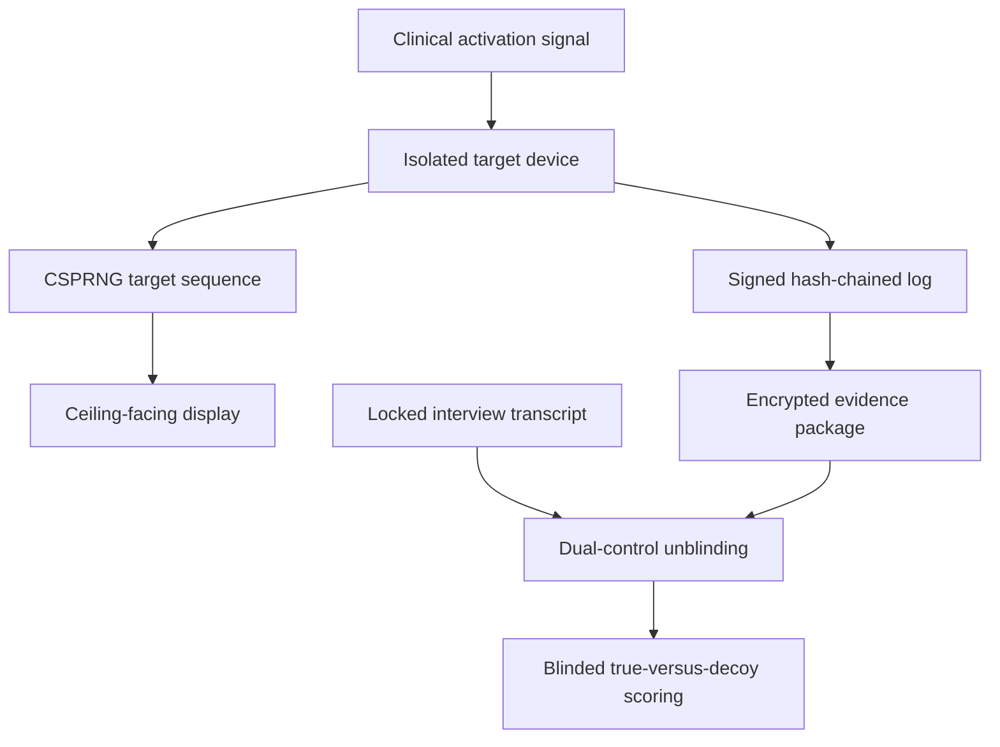

# COA-001 Target-System Security Specification

**Module:** TS-001  
**Version:** 0.1  
**Date:** 2026-09-17  
**State:** DRAFT / ENGINEERING AND ADVERSARIAL REVIEW REQUIRED  
**Parent protocol:** COA-001 v0.1  
**Governance:** Issue #356 · Draft PR #357

## Purpose

This specification defines how COA-001 visual targets are generated, displayed, timestamped, concealed, recorded and unblinded.

Its purpose is to make five claims auditable:

1. the target was not predictable before activation;
2. the target was actually displayed during the recorded interval;
3. clinical staff, interviewers and participants could not ordinarily inspect the target;
4. the stored sequence was not altered retrospectively;
5. the sequence remained concealed until the participant's transcript was locked.

Passing this specification establishes target-system integrity only. It is not evidence for awareness, anomalous perception or continuity.

## Normative language

**MUST**, **MUST NOT**, **REQUIRED**, **SHOULD** and **MAY** indicate requirement strength for the eventual frozen protocol. Every deviation MUST create an immutable deviation record and a prespecified analysis consequence.

## System boundary

The visual target system MUST remain operationally separate from:

- the clinical record;
- the participant-facing interview system;
- the auditory-control system;
- the scorer interface;
- the public website and AkashicNET publication systems.

## Threat model

| Threat | Required control | Failure consequence |
|---|---|---|
| Target predicted before activation | post-activation CSPRNG generation; no pre-generated event sequence | event excluded from per-protocol target analysis |
| Staff view target | ceiling orientation, privacy hood, viewing-angle test and installation photograph | concealment breach review |
| Reflection or secondary display | site-specific optical survey under clinical lighting | unresolved exposure routes recorded |
| Staff discuss target | staff never receive target; contamination interview logs all discussion | affected record flagged |
| Interviewer accesses target | separate roles and credentials; unblinding disabled until transcript lock | critical breach |
| Seed or sequence recovered locally | encrypted evidence package; no plaintext administrative interface | device integrity failure |
| Log altered or reordered | canonical records, hash chain and device signature | log invalid |
| Clock altered or drifting | monotonic event clock plus authenticated wall-time sources and offset logs | timing-invalid analysis status |
| Log deleted | append-only local storage plus replicated encrypted receipt | denominator retained; exposure marked unresolved |
| Device replaced or firmware changed | serial number, secure-boot/firmware measurement and deployment manifest | integrity review or exclusion |
| Network attacker changes data | no network dependency for target generation/display; authenticated encrypted export | reject unverifiable package |
| Insider changes transcript | transcript hash/signature committed before unblinding | critical breach |
| Target library changed mid-study | preregistered manifest and per-asset hashes | asset mismatch |
| Case/target mapping leaked | pseudonymous event IDs; role-separated linkage table | affected cases removed from per-protocol set |
| Selective publication | every activation, failure and unblinding retained in denominator ledger | progression gate failure |
| Replay of an earlier sequence | unique event nonce, device counter and activation timestamp | duplicate/replay flag |

The threat model MUST be reviewed by at least one independent security engineer and one skeptical methods reviewer before Stage 1.

## Physical installation

The device MUST:

- face upward or toward a vantage point inaccessible from the bed and normal floor-level positions;
- be enclosed by a privacy hood that limits lateral and reflected visibility;
- contain no participant-facing duplicate screen;
- have cameras and microphones physically absent or disabled and sealed;
- use no visible target-identifying status light;
- present no avoidable distraction to clinical staff;
- be mounted outside the sterile and resuscitation work envelope;
- fail safely without sound, movement or clinical alarm interference;
- have a site-approved electrical and infection-control assessment.

Before activation at each site, investigators MUST document:

- device serial number and installation position;
- photographs from bed, doorway and normal staff positions;
- viewing-angle and reflection tests across expected lighting conditions;
- firmware/software measurement;
- asset-library manifest hash;
- device public signing key;
- clock-source configuration;
- tamper-seal identifiers.

No photograph may contain patient information.

## Target library

The complete target library MUST be frozen before recruitment.

Each target SHOULD be a high-contrast composite containing independently scoreable attributes, provisionally:

- one visually distinct symbol or object;
- one colour class robust to common colour-vision differences;
- one two-digit code;
- one spatial arrangement or orientation.

The final components require human-factors testing. They MUST avoid culturally loaded, frightening, erotic, medical or death-associated imagery.

The library manifest MUST record:

- immutable target ID;
- asset filename;
- cryptographic digest;
- component labels;
- visual-complexity class;
- colour and accessibility metadata;
- creation and rights provenance;
- approved study version.

The full manifest digest MUST be preregistered. Assets MUST NOT be added, removed or replaced after recruitment begins. A new library requires a new protocol version.

## Random generation

### Entropy and generator

At activation the device MUST obtain fresh entropy from a reviewed operating-system or hardware source and instantiate a cryptographically secure deterministic random bit generator using an approved profile.

The implementation SHOULD follow a reviewed DRBG construction such as those specified by [NIST SP 800-90A Rev. 1](https://csrc.nist.gov/pubs/sp/800/90/a/r1/final). The precise algorithm, library, version, entropy-source health tests and reseeding policy MUST be frozen before Stage 1.

The generator MUST NOT use:

- wall-clock time as its sole seed;
- a human-entered seed;
- sequential case identifiers;
- a remotely supplied target index;
- a reusable test seed in production.

### Session construction

Each activation MUST create:

- a 256-bit event nonce;
- a fresh session seed;
- a monotonically increasing device activation counter;
- a pseudonymous event identifier that does not encode patient identity;
- a deterministic sequence derived from the session seed and frozen target manifest.

The seed MUST be encrypted immediately for later audit and MUST NOT be displayed or written to ordinary application logs.

### Sampling

Target selection MUST use rejection sampling or another reviewed unbiased mapping from random bits to the target set. Simple modulo reduction is forbidden unless the implementation demonstrates that it introduces no bias.

The algorithm MUST specify whether sampling is with or without replacement. This choice, and all balancing constraints, MUST be visible in the preregistration because adaptive balancing can make future targets predictable.

## Display sequence

The provisional Stage-1 sequence uses fixed-duration epochs. The exact epoch length requires simulation and human-factors review; **15 seconds is a test value, not yet frozen**.

Each displayed epoch MUST log:

- event ID;
- sequence number;
- target ID;
- scheduled monotonic start;
- actual display-on timestamp;
- actual display-off timestamp;
- render acknowledgement;
- frame or display-health result;
- preceding record hash;
- current record hash;
- device signature.

A neutral non-target screen MUST appear before activation and after the study interval. It MUST not encode target identity.

A display failure, partial render, power interruption or uncertain on/off time MUST be recorded automatically. Missing data MUST never be reconstructed manually.

## Log integrity

### Canonical event records

Event records MUST have a deterministic serialization before hashing or signing. JSON records SHOULD use the [RFC 8785 JSON Canonicalization Scheme](https://www.rfc-editor.org/rfc/rfc8785.html), which provides an invariant representation suitable for repeatable hashing and signing.

Each log record MUST include:

- schema and protocol version;
- device and deployment-manifest IDs;
- event nonce and activation counter;
- monotonic and wall-clock times;
- clock offset and uncertainty;
- target-manifest digest;
- encrypted target/seed payload reference;
- device-health state;
- prior record digest;
- current record digest;
- digital signature.

### Hash chain

For each record, the system MUST calculate a secure hash across the previous record digest and the current canonical record body. SHA-256 or a stronger approved Secure Hash Standard profile MAY be used; the final algorithm profile MUST be frozen.

The first event record MUST bind:

- the deployment manifest;
- target-library digest;
- software/firmware measurement;
- device public key;
- event nonce;
- activation counter.

The final record MUST include a session-closing digest and record count. Broken chains, duplicate sequence numbers or missing records invalidate the per-protocol log.

### Digital signatures

The device MUST sign records with a non-exportable signing key held in a hardware-backed keystore where feasible. The public key and device-to-site binding MUST be registered before recruitment.

The final signature algorithm MUST be selected with institutional security review. Algorithm substitution during the study is prohibited without a new protocol version.

## Encryption and custody

Target identities, session seed and sequence MUST remain encrypted outside the target device.

The evidence package MUST use authenticated encryption and bind:

- ciphertext;
- event ID;
- device ID;
- protocol version;
- target-manifest digest;
- log-chain closing digest.

Private decryption material MUST be unavailable to:

- clinical staff;
- interviewers;
- transcript processors;
- target scorers;
- participants;
- ordinary device administrators.

Decryption MUST require dual-control authorization by two independent custodial roles. The production system SHOULD use a hardware security module or comparably controlled offline key custody. Backup keys require the same controls and audit trail.

Exported encrypted packages MUST be copied to at least two controlled repositories. Replication confirms preservation; it does not grant unblinding access.

## Timestamp architecture

The system MUST maintain:

1. a **monotonic clock** for event ordering and epoch duration;
2. a **UTC wall clock** for alignment with clinical records;
3. logged offset and uncertainty estimates;
4. synchronization evidence before and after each activation where possible.

Wall time SHOULD use at least two independent authenticated sources. Network Time Security as specified in [RFC 8915](https://www.rfc-editor.org/rfc/rfc8915.html) is one acceptable network profile; hospital-approved alternatives MAY be used.

The device MUST continue recording monotonic time during network loss. Network access MUST NOT be required to generate or display targets.

The Stage-1 gate remains:

- at least 95% of valid activations aligned within ±1 second;
- every activation reports its measured uncertainty;
- timing outside tolerance remains in the denominator but is excluded from time-specific per-protocol analysis.

An independent timestamp receipt MAY be used when available. RFC 3161 provides a standard timestamp protocol, but any deployment must be reviewed for hospital privacy and network constraints.

## Activation and stopping

Activation SHOULD be automatic from a hospital-approved, non-interfering signal. Manual activation MAY be used only if:

- the activator cannot view or choose the target;
- activation latency is logged;
- the action never delays care;
- manual and automatic activations are distinguished in analysis.

The device MUST stop on a frozen rule based on a clinical/end-of-event signal or maximum duration. Staff MUST always be able to power down the device for safety without revealing targets; safety shutdowns remain in the denominator.

## Transcript lock and unblinding

Unblinding is prohibited until:

1. the participant interview is complete;
2. audio/video source files are write-protected;
3. the transcript is finalized;
4. the contamination/exposure audit is complete;
5. transcript and interview-metadata digests are calculated;
6. those digests receive an independent timestamp or repository receipt;
7. the case linkage is verified;
8. both designated custodial roles authorize release.

The unblinding request MUST bind the event ID, transcript digest, protocol version and reason for access.

Every unblinding MUST produce an append-only record containing:

- request and approval times;
- authorizing role IDs;
- target-package digest;
- transcript digest;
- released scope;
- software used;
- verification result;
- any deviation.

Interviewers MUST never participate in unblinding. Primary scorers SHOULD remain blind by receiving shuffled true and decoy packages rather than a labelled true sequence.

## Decoy generation

Decoys MUST be produced by the same frozen algorithm and target library as true sequences. They MUST match the true sequence on:

- number and duration of epochs;
- target-component frequency;
- visual-complexity distribution;
- missingness and display-health pattern where applicable.

A separate randomization service SHOULD assign true and decoy sequence labels. Scorers MUST not know the true sequence position.

The number of decoys, ranking statistic, tie handling and family-wise multiplicity procedure MUST be frozen before any Stage-2 transcript is opened.

## Role separation

| Role | May access participant identity | May access locked transcript | May access target sequence before scoring lock |
|---|---:|---:|---:|
| Clinical team | As required for care | No study access | No |
| Interviewer | Minimum necessary | Yes | No |
| Transcript processor | Pseudonymous only | Yes | No |
| Device engineer | No | No | Encrypted only |
| Key custodian | No | Digest only | Ciphertext/decryption role only |
| Decoy coordinator | No | Digest only | True/decoy packages without identity |
| Primary scorer | No | Redacted transcript | Shuffled packages only |
| Independent auditor | Pseudonymous linkage if approved | After lock | After authorized audit |
| Public/AkashicNET team | No | No raw transcript | No case-level sequence |

No individual SHOULD control target generation, transcript preparation and unblinding.

## Failure taxonomy

Every event MUST receive one or more machine-readable states:

- `VALID_TARGET_EXPOSURE`
- `NO_ACTIVATION`
- `LATE_ACTIVATION`
- `PARTIAL_DISPLAY`
- `POWER_INTERRUPTION`
- `CLOCK_OUT_OF_TOLERANCE`
- `LOG_CHAIN_INVALID`
- `SIGNATURE_INVALID`
- `ASSET_MANIFEST_MISMATCH`
- `DEVICE_INTEGRITY_FAIL`
- `CONCEALMENT_BREACH`
- `PREMATURE_UNBLIND`
- `CASE_LINKAGE_UNCERTAIN`
- `PACKAGE_UNRECOVERABLE`
- `SAFETY_SHUTDOWN`

Failure records MUST remain in the complete event denominator. A record may be unsuitable for target efficacy analysis while still contributing to feasibility and safety results.

## Commissioning tests

Before clinical deployment, every device build MUST pass:

1. deterministic reproduction from known test vectors;
2. entropy-source and DRBG health tests;
3. target-frequency and sequence-bias simulations;
4. canonicalization, hash-chain and signature test vectors;
5. deliberate tamper and corrupted-log detection;
6. encryption/decryption and wrong-key rejection;
7. premature-unblinding rejection;
8. power-loss recovery;
9. network-loss operation;
10. clock-drift and time-source disagreement tests;
11. duplicate/replay detection;
12. display-on/off timing verification with an independent sensor;
13. viewing-angle and reflection testing;
14. safe shutdown and clinical non-interference review;
15. end-to-end synthetic case rehearsal through blinded scoring.

Commissioning results, test software and expected outputs MUST be versioned. Production private keys and real target seeds MUST never appear in public repositories or CI logs.

## Stage-1 security gates

| Gate | Pass condition |
|---|---:|
| Deployment manifests complete | 100% of installed devices |
| Asset-manifest match | 100% of valid exposures |
| Valid signature and hash chain | ≥95% of activations |
| Encrypted package recovery | ≥98% of activations |
| Premature unblinding | 0 analysed cases |
| Unauthorized plaintext target access | 0 confirmed incidents |
| Clock alignment within ±1 second | ≥95% of valid activations |
| Viewing-route failure after installation | 0 unresolved routes |
| Critical safety interference | 0 events |
| Complete activation/failure denominator | ≥98% of eligible events |

A missed mandatory gate pauses progression regardless of any apparent target correspondence.

## Standards profile

The v0.1 design is informed by:

- [NIST SP 800-90A Rev. 1](https://csrc.nist.gov/pubs/sp/800/90/a/r1/final) for reviewed deterministic random-bit-generator constructions;
- [FIPS 180-4 Secure Hash Standard](https://csrc.nist.gov/pubs/fips/180-4/upd1/final) for secure hash functions;
- [RFC 8785](https://www.rfc-editor.org/rfc/rfc8785.html) for canonical JSON suitable for repeatable hashing and signing;
- [RFC 8915](https://www.rfc-editor.org/rfc/rfc8915.html) for authenticated Network Time Protocol;
- [RFC 3161](https://www.rfc-editor.org/rfc/rfc3161.html) as a possible independent timestamp-receipt profile.

These references do not by themselves certify the design. Institutional security, medical-device, privacy and legal review remain required.

## Governance lock

- COA-001: **DRAFT / STAGE 0**
- Target-system security: **SPECIFIED, NOT IMPLEMENTED OR VALIDATED**
- Protocol feasibility: **NOT ESTABLISHED**
- BQ001: **UNRESOLVED · Level 8/10**
- Accepted canonical edges: **0**
- `supports_models`: **[]**
- Truth inference: **OFF**
- Scientific-evidence promotion: **OFF**
- Rights/public synthesis: **OFF**
- Website promotion: **OFF**

This document is an engineering specification. It is not a clinical protocol approval, deployed device, trial registration, result or evidence for continuity.
